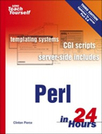

```
Roberto Nogueira  BSd EE, MSd CE
Solution Integrator Experienced - Certified by Ericsson
```

# Perl in 24 hours



## Table of Contents

```
Perl in 24 Hours

Table of Contents

Part I: Perl Fundamentals
[ ] Hour 1. Getting Started with Perl
[ ] Hour 2. Perl s Building Blocks: Numbers and Strings
[ ] Hour 3. Controlling the Program s Flow
[ ] Hour 4. Stacking Building Blocks: Lists and Arrays
[ ] Hour 5. Working with Files
[ ] Hour 6. Pattern Matching
[ ] Hour 7. Hashes
[ ] Hour 8. Functions
[ ] Hour 9. More Functions and Operators
[ ] Hour 10. Files and Directories
[ ] Hour 11. System Interaction
[ ] Hour 12. Using Perl s Command-Line Tools
[ ] Hour 13. References and Structures
[ ] Hour 14. Using Modules
[ ] Hour 15. Finding Permanence
[ ] Hour 16. The Perl Community
Part III: Applying Perl
[ ] Hour 17. Writing Modules
[ ] Hour 18. Object Primer
[ ] Hour 19. Data Processing
[ ] Hour 20. Perl as a Glue Language
[ ] Hour 21. Introduction to CGI
[ ] Hour 22. Basic Forms
[ ] Hour 23. Complex Forms
[ ] Hour 24. Manipulating HTTP and Cookies
Part IV: Appendixes
Appendix A. Installing Modules
```
